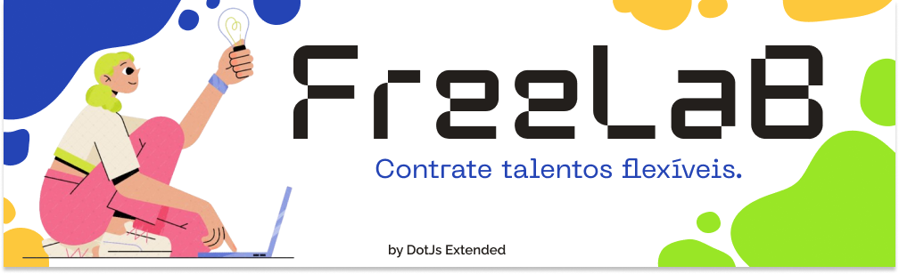

# FreeLab

FreeLaB é uma plataforma digital revolucionária que conecta freelancers e contratantes em todas as áreas. Os usuários podem criar contas como contratantes ou freelancers. Os contratantes podem postar propostas e anúncios de projetos, enquanto os freelancers podem explorar as oportunidades recomendadas com base em suas habilidades e histórico.

FreeLaB garante os direitos de ambas as partes, intermediando a contratação e o pagamento de forma segura. Com suporte disponível 24/7 e um time jurídico dedicado, oferecemos tranquilidade em todos os trâmites legais.

Além disso, a plataforma oferece funcionalidades extras, como espaços para portfólios de freelancers e relatórios detalhados para análise estatística. Comprometemo-nos com o bem-estar dos trabalhadores e a colaboração mútua, tornando o FreeLaB o ambiente ideal para projetos bem-sucedidos.

## Índice

- [Instalação](#instalação)
- [Uso](#uso)
- [Ferramentas](#ferramentas)

## Instalação

Descreva como instalar seu projeto e quaisquer dependências necessárias.

## Uso

O FreeLaB foi projetado com foco na facilidade de uso para todos os usuários. Ao criar uma conta como contratante ou freelancer, o processo é simples e direto. Os contratantes podem facilmente postar suas propostas de projeto, enquanto os freelancers encontram oportunidades relevantes na página inicial, personalizadas com base em suas habilidades e histórico.

A navegação pela plataforma é intuitiva, com menus e categorias bem organizados para facilitar a busca por projetos ou freelancers específicos. Além disso, os espaços para portfólios permitem que os freelancers mostrem seu trabalho de forma profissional.

Os recursos adicionais, como relatórios estatísticos, proporcionam insights valiosos sobre o desempenho e os ganhos, auxiliando tanto contratantes quanto freelancers a tomarem decisões informadas.

## Ferramentas
 

  
    
  
  
  
  
  
    
  
  

